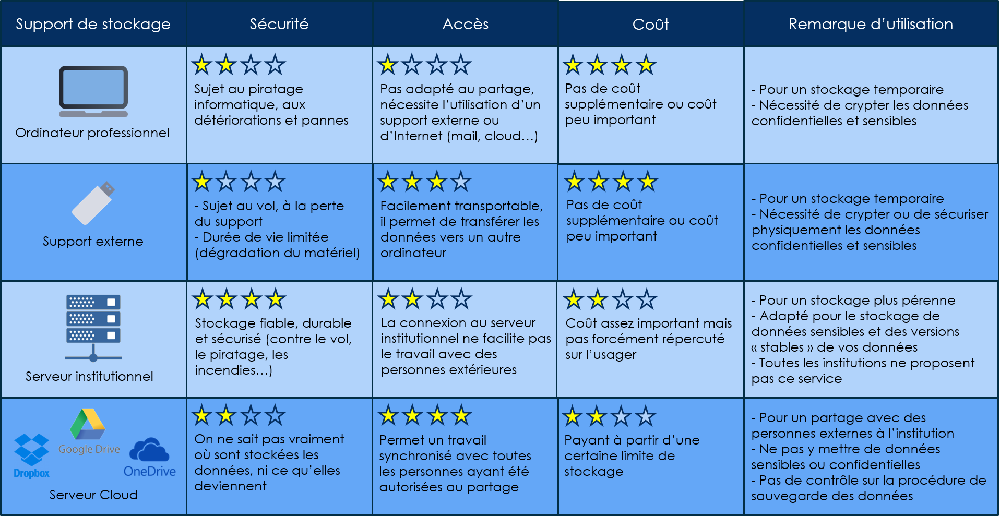

# 2. Décrire le chemin d'accès aux produits de recherche pour chaque niveau d'accès


L'accessibilité à vos données doit être mentionnée dans la documentation ou les métadonnées. S'il existe des contraintes liées au type de données (sensibles, confidentielles), elles doivent figurer dans le PGD.


## Stockage et sauvegarde pendant le processus de recherche

La gestion des données de recherche du projet doit être réfléchie et organisée différemment en fonction de l'étape à laquelle on se situe, pendant et après le projet.

La première étape concerne le **stockage sécurisé** et la **sauvegarde** des données durant toute la durée du projet. Les objectifs sont de :

* garantir la sécurité des données,
* faciliter l'accès pour l'ensemble des collaborateurs du projet.

Il est très important de prévenir la perte et la dégradation des données pendant le projet du fait :

* du matériel
* du logiciel utilisé
* du format de fichier
* de la perte de la signification du contenu
* d'un mauvais étiquetage
* d'un manque de rigueur dans le nom des fichiers.

Source : Marie-Claude Quidoz - [Atelier « Carnets de terrain électroniques »](http://rbdd.cnrs.fr/IMG/pdf/quidoz\_atelier2018.pdf?480/cd645e6864223eaae2a37ea4d2b45077f07b61d1), Montpellier, 28-29/03/2018

### Mesures de sauvegarde à mettre en place

Une sauvegarde efficace signifie qu'il faut **dupliquer et stocker** les données à différents endroits sur différents supports selon une temporalité pertinente pour le projet.

L'idéal est d'appliquer la **règle du 3-2-1**, ce qui veut dire :

* garder 3 exemplaires des données,
* sur 2 supports ou technologies différents,
* dont 1 se trouve hors site.

Dans tous les cas, il faut organiser et planifier ces sauvegardes en veillant à bien gérer les versions. A chaque point d'étape du projet, sélectionner les données à sauvegarder, à supprimer. Les différents états des données sont conservés en corrélation avec les différentes étapes de traitement, ce qui permet de revenir à une version antérieure si besoin.\
\
Cela nécessite aussi de définir un hébergement et une politique de sauvegarde adaptés aux besoins du projet concernant les spécificités de stockage des données (par exemple en cas de données sensibles, de grosse volumétrie...). Cela peut être sur des serveurs locaux (machines virtuelles), un cloud institutionnel avec accès sécurisé...

Il est recommandé d'éviter au maximum les outils du type One Drive, Google Drive, Dropbox, etc.


**Dans tous les cas, ne pas hésiter à se rapprocher de son établissement afin de connaitre les espaces de stockage sécurisés mis à disposition.**


## COMPARATIF DES DIFFÉRENTS SUPPORTS DE STOCKAGE

Sans aller dans les extrêmes, il vous faut quand même être en mesure d’**anticiper ces risques** et de prendre des mesures adaptées à la grandeur des dommages potentiels. **Chaque support a ses avantages et inconvénients**, notamment en terme de coût, de sécurité, de capacité de stockage, et d’accès.

Crédits :

Inist-CNRS - [PARCOURS INTERACTIF SUR LA GESTION DES DONNÉES DE LA RECHERCHE](https://doranum.fr/enjeux-benefices/parcours-interactif-sur-la-gestion-des-donnees-de-la-recherche/)

Merci aux contributeurs des PGD publics sur DMP OPIDoR d'avoir partagé leur PGD librement.
