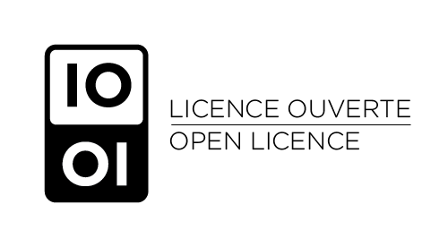

# 1. Choisir le type de licence adapté à mes besoins


Pour rendre vos données réutilisables, il est important d'attribuer une licence et de la mentionner dans les métadonnées qui y définira le contexte. Vous trouverez quelques recommandations et exemples pour guider votre réflexion.


Il est recommandé de renseigner la licence dans les métadonnées au fur et à mesure de l’avancée du projet, avec une attention particulière :

* au moment du partage des données,
* puis à l'étape de l'archivage pérenne (des métadonnées spécifiques seront à renseigner).

Il existe de nombreuses licences, modulables en fonction de vos besoins pour certaines, très spécifiques pour d'autres. Voici quelques exemples (liste non exhaustive) :

Licence ouverte (Etalab)

En France, la réglementation stipule que la licence ouverte (Etalab) doit être attribuée aux données publiques. Cette licence ouverte, libre et gratuite est compatible avec la CC-BY 2.0, ce qui veut dire que la paternité des données devra être mentionnée en cas de réutilisation des données.

Creative Commons CC0

C'est une licence ouverte conçue pour les données dédiées au domaine public. Voir la [fiche ](https://creativecommons.org/publicdomain/zero/1.0/deed.fr)et le [site Creative Commons français](https://creativecommons.org/licenses/?lang=fr-FR).

Licences CC - Creative Commons

Il existe 6 licences gratuites Creative Commons combinant quatre éléments :

\- BY = attribution

\- NC = pas d'utilisation commerciale

\- SA = partage dans les mêmes conditions

\- ND = pas de modification

Voici les 6 licences Creative Commons et leurs icônes correspondantes (illustration ci-dessous) :

\- CC BY

\- CC BY-ND

\- CC BY-NC-ND

\- CC BY-NC

\- CC BY-NC-SA

\- CC BY-SA

La plus permissive est la CC BY et la plus restrictive est la CC BY-NC-ND.

Licences pour logiciels

Certaines licences sont dédiées aux logiciels comme la licence de logiciel libre [GNU GPL](https://fr.wikipedia.org/wiki/Licence\_publique\_g%C3%A9n%C3%A9rale\_GNU) (GNU General Public License ou licence publique générale GNU) ou la licence de logiciel libre [CeCILL-B](https://fr.wikipedia.org/wiki/Licence\_CeCILL). Cette dernière a été créée conjointement par le CEA, le CNRS et l'INRIA ([en savoir plus](https://cecill.info)).

Licences pour base de données

Il existe des licences spécifiques aux bases de données comme la licence libre [Open Database License (ODbL)](https://fr.wikipedia.org/wiki/Open\_Database\_License), [Open Data Commons](https://opendatacommons.org/licenses/by/1-0/) (ODC-by)


Notez que dans le cas de données publiques ayant une visibilité internationale, il est tout à fait **possible d'attribuer à la fois une Licence ouverte Etalab et une licence CC-By**.


## Vérifier la compatibilité entre les différentes licences utilisées

Il est à noter que la licence ouverte d’Etalab est compatible avec la licence Creative Commons CC-BY et que la licence ODBL est similaire à la licence Creative Commons CC-BY-SA. Le choix de ces deux licences CC pourra donc s’apprécier en fonction du contexte international et des politiques des entrepôts scientifiques. En revanche les Creative commons CC-BY-ND (sans modification) et CC-BY-NC (sans usage commercial) sont à éviter dans le contexte de l’open data.

Crédits :

Inist-CNRS - [PARCOURS INTERACTIF SUR LA GESTION DES DONNÉES DE LA RECHERCHE](https://doranum.fr/enjeux-benefices/parcours-interactif-sur-la-gestion-des-donnees-de-la-recherche/)

Merci aux contributeurs des PGD publics sur DMP OPIDoR d'avoir partagé leur PGD librement.
